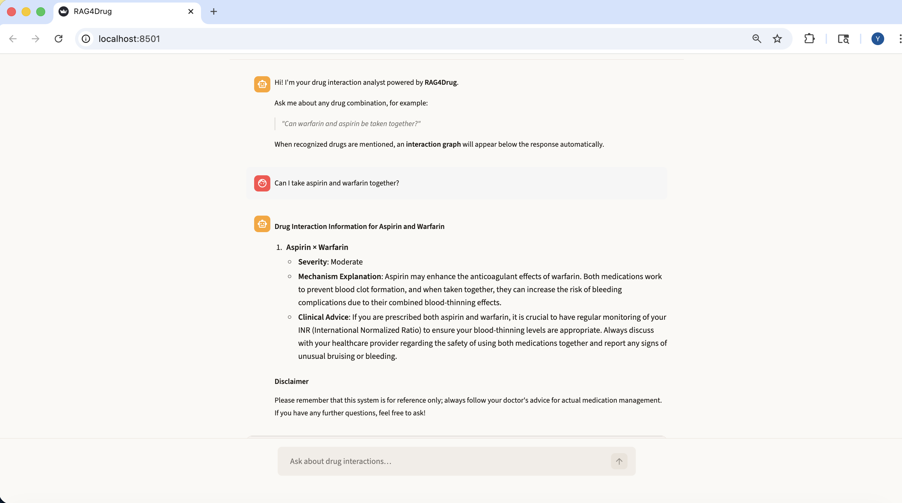
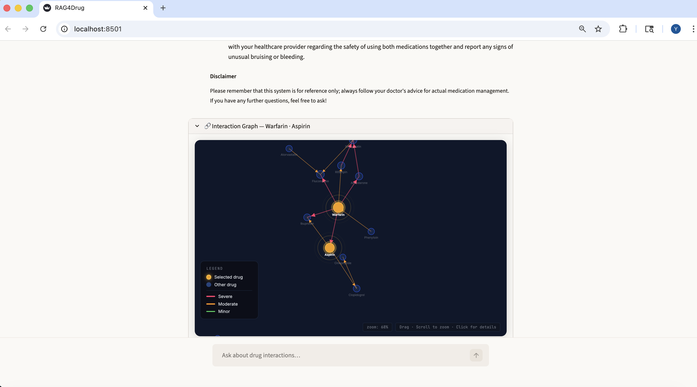

# RAG4Drug — Drug Interaction Intelligence

A Retrieval-Augmented Generation (RAG) system for drug interaction consultation, built on the DrugBank database. The system combines structured SQL retrieval with semantic vector search to answer clinical drug interaction questions, and includes a full evaluation pipeline and an interactive D3.js knowledge graph visualization.

---

## Screenshots

<!-- Add your screenshots to a docs/ folder and update the paths below -->

| Chatbot UI | Knowledge Graph |
|:---:|:---:|
|  |  |

---

## System Architecture

```
User question: "Can warfarin and aspirin be taken together?"
                         │
                         ▼
               ┌──────────────────┐
               │  NER Extraction  │  LLM extracts drug names
               │  + Alias Lookup  │  Warfarin → DB00001
               └────────┬─────────┘
                        │
           ┌────────────┴─────────────┐
           ▼                          ▼
  ┌─────────────────┐      ┌──────────────────────┐
  │     SQLite      │      │       ChromaDB        │
  │  Exact Lookup   │      │   Semantic Search     │
  │                 │      │                       │
  │ • Interactions  │      │ • Mechanism of action │
  │ • Severity      │      │ • Pharmacodynamics    │
  │ • Food warnings │      │ • Indications         │
  └────────┬────────┘      └──────────┬────────────┘
           └────────────┬─────────────┘
                        │  Merge dual-path context
                        ▼
               ┌─────────────────┐
               │   LLM Report    │
               │  (GPT-4o-mini)  │
               └─────────────────┘
```

| Database | Answers what? | Strength |
|----------|--------------|----------|
| SQLite | Does interaction X–Y exist? Severity? | Exact, fast, no hallucination |
| ChromaDB | Why does this interaction occur? Mechanism? | Semantic understanding |

---

## File Structure

```
RAG4Drug/
│
├── 🤖  Core RAG
│   ├── rag.py                     Dual-path RAG service (SQLite + ChromaDB)
│   ├── drug_sql_retriever.py      LLM-based NER + structured SQL retrieval
│   ├── vector_store.py            ChromaDB vector store service
│   ├── data_configuration.py      Global config (models, paths, session)
│   └── file_history_store.py      Conversation history persistence
│
├── 🗄️  Data Pipeline
│   ├── xml_parser.py              Parse DrugBank XML → SQLite + ChromaDB
│   ├── data_cleaning.py           DrugBank data cleaning utilities
│   └── knowledge_base.py          Knowledge base management helpers
│
├── 📊  Evaluation
│   ├── build_eval_set.py          Generate 50-item eval set from DrugBank
│   ├── evaluate.py                LLM-alone vs RAG, LLM-as-Judge scoring
│   ├── baseline.py                LLM-alone baseline (no retrieval)
│   ├── eval_set.json              50 evaluation questions with ground truth
│   ├── eval_results.json          Per-question results (latency, scores, answers)
│   └── eval_results.xlsx          Excel report: Summary + Per-Question sheets
│
├── 🖥️  UI
│   ├── app_starter.py             Streamlit chatbot with embedded knowledge graph
│   ├── drug_interaction_graph.html  D3.js force-directed interaction graph
│   └── .streamlit/
│       └── config.toml            Claude warm-light theme
│
├── 🔧  Utilities
│   ├── check_db.py                Vector store health check
│   ├── test_rag.py                RAG integration test
│   └── app_file_uploader.py       File upload UI (auxiliary)
│
└── 📦  Data (not in repo — see setup below)
    ├── drug_db.xml                DrugBank XML dump (1.77 GB)
    ├── drug_structured.db         SQLite database (~580 MB)
    ├── chroma_db/                 ChromaDB vector database
    └── chat_history/              Conversation history files
```

---

## Evaluation

The pipeline compares **LLM Alone** (no retrieval) vs **RAG** (dual-path retrieval) across 50 curated questions drawn from DrugBank, covering five categories:

| Category | Count | Description |
|----------|-------|-------------|
| `severe` | 6 | Severe drug–drug interactions |
| `moderate` | 20 | Moderate interactions |
| `minor` | 5 | Minor interactions |
| `no_record` | 10 | Drug pairs with no DrugBank record |
| `multi_drug` | 9 | Three or more drugs simultaneously |

**Metrics scored by GPT-4o-mini (LLM-as-Judge) against DrugBank ground truth:**

| Metric | Description |
|--------|-------------|
| Factual Accuracy (0–5) | Answer accuracy vs DrugBank ground truth |
| Hallucination (T/F) | Whether specific unsupported claims were invented |
| Completeness (0–5) | Coverage of severity + mechanism + clinical advice |
| No-Record Refusal (T/F) | Correctly refusing to fabricate when no record exists |
| Faithfulness (0–5) | RAG only — grounded in retrieved context vs model knowledge |
| Hit Rate | Whether SQL retrieval found the correct interaction record |
| Latency (s) | End-to-end response time |
| Memory (MB) | RSS memory during inference |

---

## Quick Start

### 1. Clone and set up environment

```bash
git clone https://github.com/Yuge-225/RAG4Drug
cd RAG4Drug

conda create -n DeepLearning python=3.11
conda activate DeepLearning
pip install -r requirements.txt
```

### 2. Configure API key

Create a `.env` file in the project root:

```
OPENAI_API_KEY=sk-xxxxxxxxxxxxxxxxxxxxxxxx
```

### 3. Prepare data (one-time)

Obtain `drug_db.xml` from [DrugBank](https://go.drugbank.com/) and run:

```bash
python xml_parser.py --xml drug_db.xml
# Generates drug_structured.db and chroma_db/
# Supports resume — safe to restart if interrupted (~15–20 min)
```

### 4. Launch the chatbot

```bash
streamlit run app_starter.py
# Opens at http://localhost:8501
```

### 5. Run evaluation (optional)

```bash
python build_eval_set.py   # generate eval_set.json
python evaluate.py         # run full evaluation, outputs eval_results.json + .xlsx
```

---

## Tech Stack

| Component | Choice |
|-----------|--------|
| LLM | GPT-4o-mini (OpenAI) |
| Embedding | text-embedding-3-large (OpenAI) |
| Vector DB | ChromaDB |
| Structured DB | SQLite |
| RAG Framework | LangChain |
| Frontend | Streamlit |
| Visualization | D3.js (force-directed graph) |
| Data Source | DrugBank XML |

---

## .gitignore Notes

The following are excluded from version control:

```
drug_db.xml          # 1.77 GB raw data
drug_structured.db   # ~580 MB SQLite database
chroma_db/           # Vector database
chat_history/        # Runtime conversation logs
.env                 # API keys
```